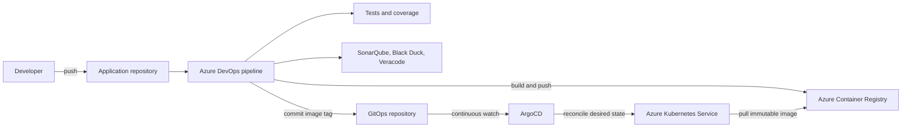

# Azure DevOps to AKS GitOps Reference Project

A production-minded reference implementation of CI with Azure DevOps and
continuous delivery with ArgoCD.

Azure DevOps builds and verifies the application, scans it with SonarQube,
Black Duck, and Veracode, publishes an immutable container tag to Azure
Container Registry (ACR), then commits that tag to a separate GitOps
repository. ArgoCD—not the pipeline—reconciles the change into AKS.

## Architecture



The CI identity needs access to ACR and the GitOps repository, but not to the
AKS API. ArgoCD is the only deployment actor.

## Repository Layout

This learning project keeps both logical repositories together for
convenience:

```text
.
├── azure-pipelines.yml              # Application repository CI
├── Dockerfile
├── scripts/update-gitops-tag.sh
├── src/                             # Python API
├── tests/
└── gitops/                          # Move to a separate repository
    ├── argocd/
    ├── charts/gitops-calculator/
    └── environments/{dev,staging,prod}/values.yaml
```

## Run Locally

The service uses only the Python standard library.

```bash
python3 -m unittest discover -s tests
python3 -m src.app
```

Try it:

```bash
curl http://localhost:8080/health
curl "http://localhost:8080/api/calculate?operation=divide&left=10&right=2"
```

Or run it as a container:

```bash
docker build -t gitops-calculator:local .
docker run --rm -p 8080:8080 gitops-calculator:local
```

## Create the Two Repositories

1. Keep the application files in one Azure Repos repository.
2. Create another repository for desired state, such as
   `platform/gitops-calculator`.
3. Copy the contents of `gitops/` to the root of that repository.
4. Replace `REPLACE_ACR_LOGIN_SERVER` in all values files.
5. Replace `REPLACE_GITOPS_REPOSITORY_URL` in the ArgoCD manifests.

The pipeline expects environment values at
`environments/<environment>/values.yaml` in the separate GitOps repository.

## Azure DevOps Configuration

Install the SonarQube and Veracode Azure DevOps extensions, then create:

- An ACR Docker Registry service connection.
- A SonarQube service connection.
- A Veracode Platform service connection.
- A secret variable group containing Black Duck and GitOps credentials.

Define these pipeline variables:

| Variable | Purpose |
|---|---|
| `acrServiceConnection` | Azure DevOps ACR service connection |
| `sonarServiceConnection` | SonarQube service connection |
| `veracodeServiceConnection` | Veracode Platform service connection |
| `blackDuckUrl` | Black Duck server URL |
| `blackDuckToken` | Secret Black Duck API token |
| `gitOpsRepositoryUrl` | HTTPS clone URL of the GitOps repository |
| `gitOpsPushToken` | Secret token with narrowly scoped Git push permission |

Authorize the pipeline to use the service connections. Protect production by
using a separate promotion pipeline or an Azure DevOps environment approval
before selecting `prod`.

## ACR and AKS

Grant AKS pull access to ACR using managed identity:

```bash
az aks update \
  --resource-group <resource-group> \
  --name <aks-name> \
  --attach-acr <acr-name>
```

Install ArgoCD in AKS using your organization’s approved release and
high-availability settings. Register the private GitOps repository with
ArgoCD, then apply:

```bash
kubectl apply -f gitops/argocd/project.yaml
kubectl apply -f gitops/argocd/applications/dev.yaml
kubectl apply -f gitops/argocd/applications/staging.yaml
kubectl apply -f gitops/argocd/applications/prod.yaml
```

The applications use ArgoCD multi-source Helm values, so use a version of
ArgoCD that supports the `$values` reference.

## Deployment and Rollback

On a successful `main` build:

1. Azure DevOps pushes `gitops-calculator:<Build.BuildId>` to ACR.
2. The pipeline updates one environment values file in the GitOps repository.
3. ArgoCD detects the commit and reconciles the namespace in AKS.

Rollback is a Git operation:

```bash
git revert <deployment-commit>
git push origin main
```

ArgoCD observes the revert and restores the prior image tag. The Git history
remains the deployment audit trail.

## Security Notes

- Use immutable build IDs or image digests for releases; do not deploy
  `latest`.
- Protect both repositories with branch policies and required reviews.
- Store all tokens in secret variables or an external secrets manager.
- Give the pipeline no AKS credentials.
- Use workload identity and managed identities where supported.
- Restrict the GitOps push identity to the required repository and branch.
- Require pull-request promotion for production in regulated environments.
