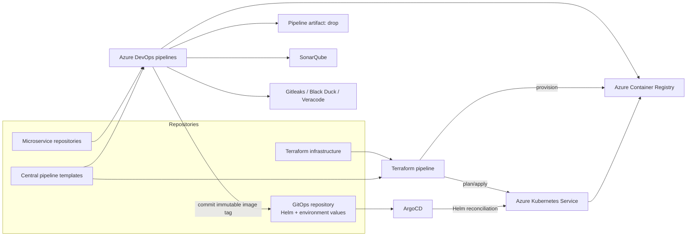

# Enterprise Azure DevOps Central Pipeline Templates

A portfolio-ready reference project based on a common enterprise platform
engineering model: many microservices consume one centrally governed Azure
DevOps pipeline.

Service teams supply parameters and their language-specific build steps. The
central templates enforce build, artifact publication, SonarQube, secret
scanning, Black Duck, Veracode, container publishing to ACR, and GitOps
promotion.

## Architecture



Azure DevOps never deploys directly to AKS. It publishes the image and updates
desired state in Git. ArgoCD monitors Git and reconciles the Helm release.

## Standard Pipeline

The governed pipeline runs:

1. Runtime setup for Python, Node.js, Java, or .NET.
2. Gitleaks secret scan across Git history.
3. SonarQube preparation.
4. Service-specific build, tests, and coverage.
5. SonarQube quality-gate enforcement.
6. ZIP packaging and `drop` pipeline artifact publication.
7. Black Duck software composition analysis.
8. Veracode static application security testing.
9. Immutable Docker image build and push to ACR.
10. GitOps Helm values update.
11. ArgoCD synchronization into AKS.

The infrastructure pipeline separately runs Terraform validate, plan, manual
approval, and approved apply for AKS, ACR, Log Analytics, and platform access.

## Repository Layout

```text
.
├── azure-pipelines.yml
├── azure-pipelines-infra.yml
├── infra/
│   └── terraform/
├── pipelines/
│   ├── templates/
│   │   ├── stages/
│   │   └── steps/
│   └── examples/
│       ├── python-service.yml
│       ├── node-service.yml
│       └── java-service.yml
├── gitops/
│   ├── argocd/
│   ├── charts/gitops-calculator/
│   └── environments/
├── src/
├── tests/
└── Dockerfile
```

The repository contains the template implementation, three example consumer
pipelines, a working Python microservice, and a representative GitOps
repository.

## Central Template Consumption

Each microservice has a small `azure-pipelines.yml`:

```yaml
resources:
  repositories:
    - repository: centralTemplates
      type: git
      name: PlatformEngineering/central-pipeline-templates
      ref: refs/tags/v1.0.0

variables:
  - group: enterprise-cicd-secrets

stages:
  - template: pipelines/templates/stages/build.yml@centralTemplates
    parameters:
      serviceName: payments-api
      language: python
      runtimeVersion: "3.12"
      workingDirectory: .
      vmImage: ubuntu-latest
      sonarProjectKey: payments-api
      enableSonarQube: true
      enableSecretScan: true
      buildSteps:
        - bash: |
            pip install -r requirements.txt
            pytest --cov=src --cov-report=xml

  - template: pipelines/templates/stages/publish.yml@centralTemplates
    parameters:
      serviceName: payments-api
      vmImage: ubuntu-latest
      artifactPath: src
      artifactName: drop

  - template: pipelines/templates/stages/security.yml@centralTemplates
    parameters:
      serviceName: payments-api
      vmImage: ubuntu-latest
      workingDirectory: .
      artifactName: drop

  - template: pipelines/templates/stages/container.yml@centralTemplates
    parameters:
      serviceName: payments-api
      vmImage: ubuntu-latest
      dockerfile: Dockerfile
      dockerBuildContext: .
      imageRepository: payments-api
      imageTag: $(Build.BuildId)
      enabled: true
```

The central stages also accept `poolName` and `poolDemands` when a service
must run on a self-hosted Azure DevOps agent pool instead of `vmImage`.

See [pipelines/README.md](pipelines/README.md) for the complete parameter
contract and language examples.

## Azure DevOps Setup

Create these repositories:

- `central-pipeline-templates`
- One repository per microservice
- `platform-infra`
- `platform-gitops`

Create the `enterprise-cicd-secrets` variable group with:

| Variable | Description |
|---|---|
| `acrServiceConnection` | ACR Docker service connection |
| `sonarServiceConnection` | SonarQube service connection |
| `veracodeServiceConnection` | Veracode Platform connection |
| `blackDuckUrl` | Black Duck server |
| `blackDuckToken` | Secret API token |
| `gitOpsRepositoryUrl` | GitOps HTTPS clone URL |
| `gitOpsPushToken` | Secret, narrowly scoped Git token |

Create the `enterprise-infra-secrets` variable group with:

| Variable | Description |
|---|---|
| `azureServiceConnection` | Azure Resource Manager service connection |
| `tfStateResourceGroup` | Terraform state resource group |
| `tfStateStorageAccount` | Terraform state storage account |
| `tfStateContainer` | Terraform state blob container |
| `approvalNotifyUsers` | Optional users or groups notified for manual approvals |
| `approvalApprovers` | Optional users or groups allowed to approve |

Detailed project creation, permissions, extensions, and governance are in
[docs/azure-devops-project-setup.md](docs/azure-devops-project-setup.md).

To bootstrap the Azure DevOps project and repositories:

```bash
./scripts/bootstrap-azure-devops.sh \
  https://dev.azure.com/<organization> \
  Enterprise-Microservices
```

## Local Application

```bash
python3 -m unittest discover -s tests
python3 -m src.app
```

```bash
curl http://localhost:8080/health
curl "http://localhost:8080/api/calculate?operation=divide&left=10&right=2"
```

## GitOps and Helm

The pipeline changes only the image tag in an environment values file.
ArgoCD owns deployment:

```text
Azure DevOps -> ACR
Azure DevOps -> GitOps commit
ArgoCD -> Helm render -> AKS
AKS -> ACR image pull
```

Rollback uses Git:

```bash
git revert <deployment-commit>
git push origin main
```

ArgoCD detects the revert and restores the prior immutable image.

## Governance

- Protect and version the central templates using release tags.
- Require template approval for every consumer pipeline.
- Keep service connections centrally managed.
- Use branch policies and mandatory security gates.
- Use environment approvals for production promotion.
- Give CI ACR push and GitOps write access, but no AKS credentials.
- Give AKS managed identity `AcrPull`.

## Required Placeholder Changes

Before deploying:

- Replace `REPLACE_ACR_LOGIN_SERVER` in GitOps values.
- Replace `REPLACE_GITOPS_REPOSITORY_URL` in ArgoCD applications.
- Replace the example Azure Repos project/repository names.
- Configure all service connections and variable-group values.
