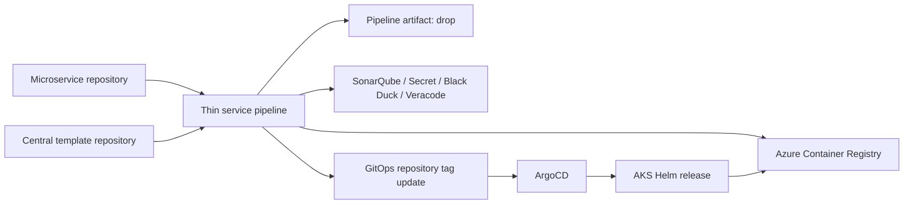

# Azure DevOps Project Setup

## Repositories

Create one Azure DevOps project, for example `Enterprise-Microservices`, with:

| Repository | Responsibility |
|---|---|
| `central-pipeline-templates` | Governed YAML templates |
| `payments-api` | Python microservice |
| `orders-api` | Node.js microservice |
| `customer-api` | Java microservice |
| `platform-gitops` | Helm charts and environment values |

The application repositories contain thin pipeline files. The shared
implementation lives only in `central-pipeline-templates`.

After signing in with `az login`, create the project and empty repositories:

```bash
az extension add --name azure-devops
./scripts/bootstrap-azure-devops.sh \
  https://dev.azure.com/<organization> \
  Enterprise-Microservices
```

The script is idempotent: existing projects and repositories are retained.

## Extensions

Install and approve:

- SonarQube Azure DevOps extension
- Veracode Azure DevOps extension

The central template runs a pinned Gitleaks container for pipeline secret
scanning. For native repository alerts and push protection, enable GitHub
Advanced Security for Azure DevOps secret scanning. Black Duck Detect is
launched by the shared template; internally mirror its bootstrap script if
your supply-chain policy requires it.

## Service Connections

Create:

| Name | Type | Scope |
|---|---|---|
| `sc-acr-enterprise` | Docker Registry / ACR | Push images |
| `sc-sonarqube-enterprise` | SonarQube | Analyze projects |
| `sc-veracode-enterprise` | Veracode Platform | Upload and scan |

Expose their names through the shared variable group:

```text
acrServiceConnection=sc-acr-enterprise
sonarServiceConnection=sc-sonarqube-enterprise
veracodeServiceConnection=sc-veracode-enterprise
```

## Variable Group

Create `enterprise-cicd-secrets` and authorize it for approved pipelines:

| Variable | Secret |
|---|---|
| `acrServiceConnection` | No |
| `sonarServiceConnection` | No |
| `veracodeServiceConnection` | No |
| `blackDuckUrl` | No |
| `blackDuckToken` | Yes |
| `gitOpsRepositoryUrl` | No |
| `gitOpsPushToken` | Yes |

Prefer Azure Key Vault-backed variable groups for tokens.

## Pipeline Creation

Create one pipeline per microservice and select the service repository's
`azure-pipelines.yml`. Each file imports the central repository, includes the
shared stage template, and passes only service-specific parameters.

Grant the pipeline's Build Service identity read access to
`central-pipeline-templates`. Grant its GitOps identity contribute permission
only to `platform-gitops`.

## Governance

- Require pull requests and two reviewers for central-template changes.
- Require successful template validation before merge.
- Add required-template approval to service pipelines.
- Tag stable template releases such as `v1.0.0`.
- Restrict production GitOps changes to pull requests and environment
  approvals.
- Do not give CI pipelines AKS credentials.
- Give AKS managed identity `AcrPull`; give CI only ACR push rights.

## Delivery Flow


